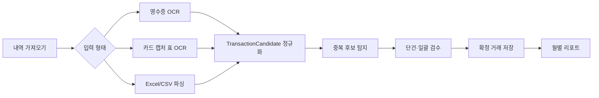

# Spendly

> 영수증·카드 사용내역 캡처·Excel/CSV를 하나의 거래 형식으로 정리하는 Flutter 소비관리 앱


## 현재 상태

Spendly는 **기획·UI 설계와 Flutter 프로젝트 기반 구축 단계**입니다. 아래 화면은 구현 목표를 검증하기 위한 디자인 목업이며, OCR·Firebase 파이프라인과 실제 데이터 처리는 아직 개발 중입니다.

- [x] 사용자 문제와 MVP 범위 정의
- [x] 주요 화면 플로우·엣지 케이스 설계
- [x] 비-Material UI 방향과 7개 주요 화면 목업
- [x] Flutter Android·iOS 프로젝트 생성
- [ ] 입력 수집과 로컬 작업 큐
- [ ] Firebase 비동기 처리 파이프라인
- [ ] 단건·일괄 검수와 중복 연결
- [ ] 리포트와 운영 품질

## 해결하려는 문제

개인의 소비 기록은 종이 영수증, 카드 앱 화면, 카드사 Excel 파일에 흩어져 있습니다. 이를 가계부에 한 줄씩 옮기면 번거롭고, 서로 다른 자료를 함께 가져오면 같은 결제가 중복될 수 있습니다.

Spendly는 입력 형태별로 데이터를 분석한 뒤 모두 `TransactionCandidate`로 정규화합니다. 사용자는 잘못 읽힌 항목과 중복 후보만 확인하고, 확정한 거래만 월별 리포트에 반영합니다.

## 핵심 사용자 흐름



## 핵심 설계 판단

### 1. 영수증이 아니라 거래를 중심 모델로 사용

영수증, 카드 캡처, 스프레드시트는 입력 방식만 다릅니다. 최종 결과는 공통 `Transaction` 모델로 저장하고, 원본은 `sourceRefs`로 연결합니다. 같은 결제가 영수증과 카드내역에 모두 있어도 거래 한 건에 여러 근거를 보관할 수 있습니다.

### 2. 중복 후보를 자동 삭제하지 않음

날짜·금액·정규화된 상호명·결제수단·원본 해시를 조합해 중복 가능성을 계산하되, 최종 판단은 사용자가 합니다. 잘못된 자동 병합으로 소비 기록이 사라지는 위험을 피하기 위한 결정입니다.

### 3. 오류 행과 정상 행을 분리

Excel 한 행의 날짜 형식이 잘못돼도 전체 가져오기를 실패시키지 않습니다. 정상 행은 먼저 확정하고 오류 행은 `needsReview` 상태로 남겨 이어서 수정할 수 있도록 설계했습니다.

### 4. 클라이언트가 처리 완료를 결정하지 않음

업로드 이후 OCR·파싱·중복 탐지는 서버 상태를 기준으로 진행합니다. 함수가 중복 실행돼도 결과가 중복 저장되지 않도록 `importId`, `sourceRow`, `fingerprint`를 멱등성 키로 사용합니다.

## UI 원칙

기본 Material 컴포넌트처럼 보이는 화면을 피하고 프로젝트 전용 시각 언어를 사용합니다.

- `Icons.*`와 Material Icons 미사용
- 기본 `AppBar`, `FloatingActionButton`, `ListTile`, `ElevatedButton`, `BottomNavigationBar` 외형 미사용
- 별도 SVG 제작 없이 `phosphor_flutter`의 Regular 아이콘을 사용
- 화면은 패키지를 직접 호출하지 않고 `SpendlyIcon` 의미 기반 래퍼만 사용
- 세이지·크림·포레스트·살구색 디자인 토큰
- 카드 남발 대신 여백·타이포그래피·얇은 구분선으로 위계 표현
- 차트와 동일한 정보를 텍스트로도 제공

### 아이콘 선택 이유

1인 프로젝트에서 전용 SVG 세트를 직접 제작하면 아이콘 품질과 기능 개발 속도를 동시에 관리하기 어렵습니다. Spendly는 MIT 라이선스의 Phosphor Icons를 사용하고, 초기에는 선 굵기가 일정한 `Regular` 스타일만 허용합니다. 아이콘 이름은 화면 의미에 맞춘 `SpendlyIconName`으로 한 번 더 감싸므로 패키지 교체나 아이콘 변경이 필요해도 기능 화면을 수정하지 않습니다.

## 기술 구성

아래 항목은 **목표 아키텍처**이며 구현 진행에 따라 체크합니다.

| 영역 | 기술 | 상태 |
|---|---|---|
| App | Flutter, Dart | 프로젝트 생성 완료 |
| UI | shadcn_flutter, phosphor_flutter, google_fonts | 아이콘 기반 적용 완료 |
| Chart & Motion | fl_chart, flutter_animate | 적용 예정 |
| State | Riverpod | 적용 예정 |
| Navigation | go_router | 적용 예정 |
| Backend | Firebase Auth, Firestore, Storage, Functions | 적용 예정 |
| Operations | FCM, App Check, Crashlytics, Analytics, Remote Config | 적용 예정 |
| Test | flutter_test, Firebase Emulator Suite | 적용 예정 |

## 처리 상태

```text
draft
  → preparing
  → queued
  → uploading
  → processing
  → needsReview | ready
  → partiallyCommitted | completed
```

- 앱이 종료돼도 로컬 작업 큐에서 미완료 작업을 복구합니다.
- 처리 중 삭제 요청이 발생하면 이후 서버 결과를 반영하지 않습니다.
- FCM은 완료 알림 수단이며, 알림이 없어도 앱 내부 상태 조회로 작업을 확인할 수 있습니다.

## 예정된 검증

- OCR 원문의 날짜·금액·상호 파싱 단위 테스트
- Excel/CSV 헤더 탐지와 컬럼 매핑 테스트
- 상태 머신의 허용·금지 전이 테스트
- 같은 파일 재업로드와 함수 중복 실행 멱등성 테스트
- Firestore·Storage Security Rules의 타 사용자 접근 차단 테스트
- 오프라인 촬영 → 앱 재실행 → 네트워크 복구 통합 테스트
- 처리 시간, 파싱 성공률, 수정률은 구현 후 실제 측정값만 공개

## 문서

- [아키텍처와 데이터 흐름](docs/ARCHITECTURE.md)
- [개발 로드맵](docs/ROADMAP.md)
- [UI 구현 가이드](docs/UI_GUIDE.md)

## 실행

```bash
flutter pub get
flutter run
```

현재 실행 화면은 프로젝트 상태를 안내하는 비-Material 시작 화면입니다. 기능 화면은 로드맵 순서대로 추가합니다.

## 프로젝트 정보

- 개발 형태: 1인 프로젝트
- 담당 범위: 문제 정의, UX, Flutter, Firebase, 테스트, 문서화
- 대상 플랫폼: Android 우선, iOS 검증
