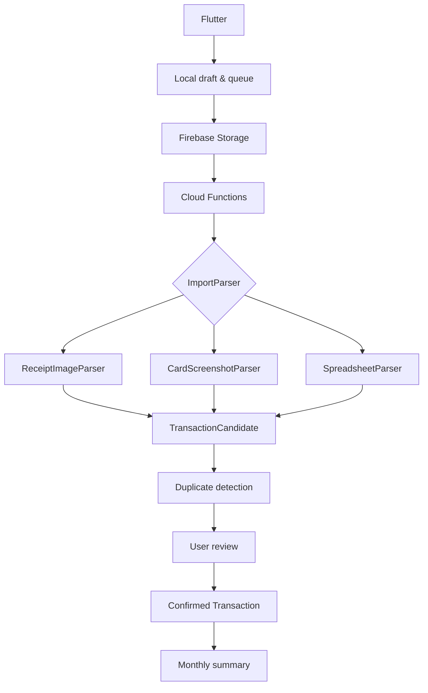

# Architecture

## 목표

입력 형식이 달라도 분석 결과를 동일한 거래 후보로 정규화하고, 비동기 작업의 재실행과 네트워크 재전송에도 중복 거래가 만들어지지 않도록 한다.

## Flutter 모듈

```text
lib/
├─ app/                 # bootstrap, router, design tokens
├─ core/                # error, analytics, local queue
├─ features/
│  ├─ auth/
│  ├─ capture/
│  ├─ imports/
│  ├─ review/
│  ├─ transactions/
│  ├─ reports/
│  └─ settings/
└─ shared/              # semantic icon wrapper and reusable UI
```

## 입력 파이프라인



## 핵심 문서

```text
users/{uid}/imports/{importId}
users/{uid}/imports/{importId}/candidates/{candidateId}
users/{uid}/transactions/{transactionId}
users/{uid}/importJobs/{jobId}
users/{uid}/monthlySummaries/{yyyyMM}
users/{uid}/devices/{deviceId}
```

## 멱등성

- 클라이언트가 최초 `importId`와 `idempotencyKey`를 생성한다.
- 원본 파일은 사용자 UID와 importId가 포함된 Storage 경로에 저장한다.
- Functions는 현재 job version과 object generation을 확인한다.
- 거래 확정 키는 `importId + sourceRow + fingerprint` 조합을 사용한다.
- 사용자 수정 필드는 서버 재분석 결과가 덮어쓰지 않는다.

## 오프라인 복구

- 로컬 draft, 원본 경로, 상태, 재시도 횟수를 영속화한다.
- 앱 재실행 시 서버 상태와 로컬 상태를 비교한다.
- 업로드되지 않은 작업은 큐로 복구한다.
- 업로드 응답이 유실된 경우 idempotency key로 기존 job을 조회한다.
