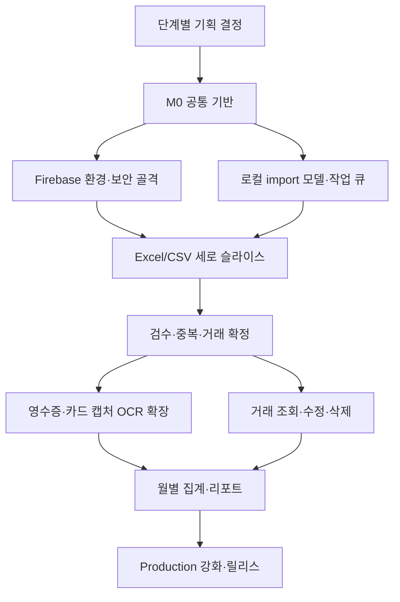

# Implementation Plan

이 문서는 Spendly의 확정된 기획과 기술 정책을 실제 개발 순서로 연결한다. `ROADMAP.md`가 **무엇을 만들지** 정의한다면, 이 문서는 **어떤 선행 조건을 충족한 뒤 무엇을 구현하고 어디서 검증할지** 정의한다.

세부 기능을 시작할 때는 이 문서를 그대로 큰 PR 하나로 구현하지 않는다. 아래 작업 묶음을 기준으로 각각 Issue를 만들고, Issue 하나당 branch 하나와 PR 하나를 사용한다.

## 1. 기준 문서와 적용 원칙

작업 전에 변경 영역에 해당하는 문서를 함께 확인한다.

| 영역 | 기준 문서 |
|---|---|
| 제품 범위와 마일스톤 | [`ROADMAP.md`](ROADMAP.md) |
| 계층과 데이터 흐름 | [`ARCHITECTURE.md`](ARCHITECTURE.md) |
| UI와 접근성 | [`UI_GUIDE.md`](UI_GUIDE.md) |
| 상태와 ViewModel | [`STATE_MANAGEMENT.md`](STATE_MANAGEMENT.md) |
| 오류 계약 | [`ERROR_HANDLING.md`](ERROR_HANDLING.md) |
| 로컬 데이터와 동기화 | [`DATA_AND_SYNC.md`](DATA_AND_SYNC.md) |
| Firebase와 보안 | [`FIREBASE_GUIDE.md`](FIREBASE_GUIDE.md) |
| 의존성 변경 | [`DEPENDENCY_POLICY.md`](DEPENDENCY_POLICY.md) |
| Git과 PR | [`GIT_WORKFLOW.md`](GIT_WORKFLOW.md) |
| 배포와 롤백 | [`RELEASE_GUIDE.md`](RELEASE_GUIDE.md) |

전체 구현에는 다음 원칙을 적용한다.

1. 사용자가 관찰할 수 있는 하나의 동작을 세로로 완성한 뒤 다음 범위로 이동한다.
2. 가장 먼저 Excel/CSV 흐름으로 입력 → 정규화 → 검수 → 확정 파이프라인을 검증한다. OCR 입력은 같은 파이프라인이 안정된 뒤 추가해 파서 문제와 시스템 문제를 분리한다.
3. 보안, 소유권, 멱등성, 오프라인 복구는 마지막에 덧붙이는 기능이 아니라 해당 데이터 경로가 처음 생길 때 함께 구현한다.
4. 모든 동작 변경은 Red → Green → Refactor 순서로 개발한다. 문서 전용 변경만 신규 테스트 작성 대상에서 제외한다.
5. 각 PR은 독립적으로 검증 가능하고 `main`을 배포 가능한 상태로 유지해야 한다.
6. 수치 목표는 측정 데이터가 생긴 뒤 정한다. 일정, OCR 정확도, 처리 시간과 비용을 근거 없이 약속하지 않는다.

## 2. 현재 출발점

현재 저장소는 기획과 Flutter 기반 구축 단계다.

- 완료: Android·iOS 프로젝트, 시작 화면, 주요 화면 목업, 의미 기반 아이콘 래퍼, Flutter CI, Android 프리뷰 빌드
- 미완료: feature-first 구조, 디자인 토큰, Riverpod 상태관리, 라우팅, 로컬 작업 큐, Firebase 연동, 실제 가져오기·검수·리포트 흐름
- 현재 앱 데이터: 실제 거래를 저장하거나 처리하지 않음

따라서 첫 기능 화면부터 만들기보다 공통 계약과 테스트 기반을 먼저 고정해야 한다.

## 3. 전체 실행 순서

권장 순서는 다음과 같다.

| 순서 | 단계 | 핵심 결과 | Roadmap 대응 |
|---|---|---|---|
| 0 | 기획 결정 게이트 | 해당 단계의 미결정 정책 해소 | 전 단계 |
| 1 | 공통 기반 | MVVM 골격, 토큰, 상태·오류 계약, 라우팅 | M0 |
| 2 | Firebase 안전 기반 | 환경 분리, Auth, Emulator, deny-by-default Rules | M1, M5 |
| 3 | 로컬 import 기반 | 공통 모델, 상태 머신, Drift draft·queue, 재실행 복구 | M1, M2 |
| 4 | Excel/CSV 세로 슬라이스 | 파일 선택부터 후보 생성과 처리 상태 확인까지 | M1, M2 |
| 5 | 검수와 거래 확정 | 단건·일괄 검수, 중복 연결, 부분 확정 | M3 |
| 6 | 이미지 입력 확장 | 영수증·카드 캡처와 OCR parser, 완료 알림 | M1, M2 |
| 7 | 거래 관리와 리포트 | 조회·수정·삭제, 월별 집계, 접근 가능한 리포트 | M4 |
| 8 | Production 강화 | App Check, 관측성, 삭제, 배포·복구 검증 | M5 |
| 9 | 릴리스 | staging과 동일 SHA의 점진 배포와 모니터링 | M5 |

## 4. 단계별 작업 계획

### 단계 0. 기획 결정 게이트

모든 결정을 한 번에 끝내지 않는다. 아래 정책은 해당 기능의 Issue를 만들기 전에 확정한다.

| 시점 | 확정할 내용 | 확정 전 금지되는 작업 |
|---|---|---|
| 공통 기반 전 | 지원 OS 범위, 초기 인증 방식, 접근성 기준 | 플랫폼별 인증 구현 |
| 파일 import 전 | 지원 확장자·인코딩·파일 크기·행 수, 컬럼 자동 탐지와 수동 매핑 규칙 | 파일 검증과 parser 확정 |
| 서버 처리 전 | 원본 보관 기간, 취소·삭제 후 늦게 도착한 결과 처리, retry 상한 | Storage lifecycle과 상태 전이 확정 |
| 검수 전 | 부분 성공 표시, 필수 수정 필드, 일괄 선택 기본값 | 검수 ViewModel 상태 확정 |
| 중복 처리 전 | 중복 후보 기준과 기본 선택, 최종 판단 UI | 자동 병합 또는 삭제 구현 |
| OCR 전 | OCR 방식·region·개인정보·비용 상한, 지원 이미지 제한 | provider와 parser 구현 |
| 거래 관리 전 | 환불·취소 표현, 수정 가능 필드, 삭제 정책 | 거래 update/delete 구현 |
| 운영 기능 전 | 알림 동의, Analytics·Crashlytics 수집 범위, 계정 삭제 보존 정책 | production 수집과 삭제 자동화 |

결정 결과는 관련 Issue와 PR의 `기획 결정`에 기록한다. 아직 결정되지 않은 항목은 추측해서 구현하지 않고 별도 Issue로 분리한다.

### 단계 1. M0 공통 기반

**선행 조건:** Issue #1의 공통 개발 규칙과 워크플로가 `main`에 반영되어 있어야 한다.

권장 작업 단위:

1. 상태관리, 라우팅, 로컬 DB, Firebase 등 필요한 dependency를 조사하고 도입 Issue에서 대안·license·보안·플랫폼 영향을 검토한다.
2. `app`, `core`, `features`, `shared` 기준으로 feature-first 진입 구조를 만들고 기존 시작 화면을 깨뜨리지 않는다.
3. 색상, 간격, 타이포그래피와 의미 기반 UI 토큰을 추가하고 목업의 대표 컴포넌트를 widget test로 고정한다.
4. `Result<T>`, `AppFailure`, 안정적인 `FailureCode`의 공통 계약을 테스트부터 정의한다.
5. Riverpod `Notifier`·`AsyncNotifier` 주입 방식과 `go_router` 라우팅 골격을 만든다.
6. unit, widget, integration, Firebase Emulator 테스트 디렉터리와 fixture 원칙을 정한다.

**산출물:** 앱 bootstrap, 공통 토큰, 상태·오류 계약, 테스트 가능한 provider·router 골격.

**완료 게이트:** 시작 화면 동작이 유지되고 format, analyze, unit/widget test, Android debug build가 통과한다. 신규 dependency는 정책 검토와 `pubspec.lock` 반영이 끝나야 한다.

### 단계 2. Firebase 안전 기반

**선행 조건:** 단계 1의 오류 계약과 의존성 주입 방식이 확정되어야 한다.

권장 작업 단위:

1. dev, staging, production Firebase 프로젝트와 앱 ID를 분리하고 production credential 없이 Emulator를 실행할 수 있게 한다.
2. Firebase Auth와 세션 복구를 repository와 ViewModel로 구현한다.
3. `users/{uid}` 하위 데이터 경로, DTO, 소유권과 schema version 계약을 문서와 테스트로 정의한다.
4. Firestore·Storage Rules를 기본 거부로 시작하고 비로그인·타 사용자·잘못된 schema 거부 테스트를 먼저 작성한다.
5. Functions의 인증, App Check, 입력 schema, 소유권과 멱등성 검증 골격을 만든다.

**산출물:** 로그인·세션 복구, 환경별 Firebase 연결, Emulator 기반 Auth·Rules 테스트.

**완료 게이트:** 본인 최소 권한만 허용되고 비로그인·타 사용자 접근이 자동 테스트에서 거부된다. staging과 production 설정이 섞이지 않는다.

### 단계 3. 로컬 import 기반

**선행 조건:** 단계 1의 상태·오류 계약과 단계 0의 import 상태 정책이 확정되어야 한다.

권장 작업 단위:

1. `Money`, `ImportDraft`, `ImportJob`, `TransactionCandidate`, `SourceRef` 등 UI에 의존하지 않는 불변 domain model을 정의한다.
2. `draft → preparing → queued → uploading → processing → needsReview | ready → partiallyCommitted | completed`의 허용·금지 전이를 테스트한다.
3. Drift가 소유하는 local draft와 작업 queue schema를 migration test와 함께 만든다.
4. 중복 탭, 앱 재실행, 네트워크 단절, retry, 취소와 늦은 응답을 ViewModel 단위 테스트로 고정한다.
5. repository fake를 사용해 로딩, 빈 상태, 오류, 재시도와 취소 UI 상태를 검증한다.

**산출물:** 공통 import domain, 상태 머신, 영속 draft·queue, 복구 가능한 ViewModel.

**완료 게이트:** 앱 재실행 후 미완료 작업이 복구되고 금지된 상태 전이는 저장되지 않는다. 금액은 최소 화폐 단위 정수와 통화 코드로만 표현한다.

### 단계 4. Excel/CSV 세로 슬라이스

Excel/CSV를 먼저 구현하면 OCR 정확도와 무관하게 전체 비동기 파이프라인과 데이터 계약을 검증할 수 있다.

**선행 조건:** 단계 0의 파일 정책, 단계 2의 소유권·Rules, 단계 3의 queue가 준비되어야 한다.

권장 작업 단위:

1. 파일 선택, 확장자·크기 검증과 안전한 오류 문구를 구현한다.
2. header 탐지, column mapping, 날짜·금액·상호 변환을 fixture 기반 parser test로 정의한다.
3. 잘못된 행은 `needsReview`로 분리하고 정상 행은 보존하는 부분 성공을 구현한다.
4. 원본을 `uid/importId` 경로로 업로드하고 MIME, 크기, 덮어쓰기 거부 Rules를 추가한다.
5. Functions에서 `importId`, source row, fingerprint를 사용해 재시도 가능한 parsing과 후보 저장을 구현한다.
6. 앱이 Firestore 상태를 source of truth로 처리 진행·실패·재시도를 보여 주게 한다.
7. 업로드 응답 유실과 동일 파일 재시도를 Emulator 통합 테스트로 검증한다.

**산출물:** Excel/CSV 선택 → local queue → upload → parse → candidate 생성 → 상태 확인의 첫 세로 슬라이스.

**완료 게이트:** 한 행의 오류가 정상 행을 폐기하지 않고, 같은 작업을 재실행해도 후보가 중복 생성되지 않으며, 타 사용자 원본과 결과에 접근할 수 없다.

### 단계 5. 검수·중복·거래 확정

**선행 조건:** 단계 4에서 실제 `TransactionCandidate`가 일관되게 생성되어야 한다.

권장 작업 단위:

1. 후보 한 건의 필드 수정, 유효성 검증과 저장되지 않은 변경 보호를 구현한다.
2. 정상·오류 후보를 함께 다루는 일괄 검수와 부분 확정을 구현한다.
3. 날짜·금액·정규화 상호명·결제수단·원본 hash 기반 fingerprint와 중복 후보 탐지를 테스트한다.
4. 중복 후보는 자동 삭제하지 않고 사용자의 선택으로 기존 거래에 `sourceRefs`를 연결한다.
5. 확정 transaction과 처리 상태를 transaction 또는 atomic batch로 저장한다.
6. 환불·취소 거래와 version 충돌을 정의된 정책대로 처리한다.
7. 가져오기 → 검수 → 확정 저장을 integration test로 검증한다.

**산출물:** 단건·일괄 검수, 중복 비교, 부분 확정, sourceRefs가 연결된 확정 거래.

**완료 게이트:** 사용자 수정값을 재처리 결과가 덮어쓰지 않고, 중복 후보의 최종 판단은 사용자에게 있으며, 부분 확정 후 남은 후보를 이어서 처리할 수 있다.

### 단계 6. 영수증·카드 캡처 OCR 확장

**선행 조건:** 단계 0의 OCR 정책과 단계 5의 검수 흐름이 준비되어야 한다.

권장 작업 단위:

1. 카메라·갤러리 권한, 영수증 단일 선택과 카드 캡처 다중 선택을 구현한다.
2. 이미지 크기·형식·개수 제한과 오프라인 draft 저장을 추가한다.
3. `ReceiptImageParser`와 `CardScreenshotParser`를 기존 candidate 계약 뒤에 연결한다.
4. OCR 원문에서 날짜·금액·상호를 정규화하는 parser test를 만든다.
5. 불확실하거나 누락된 값은 검수 대상으로 보내고 원문을 로그·Analytics·FCM에 남기지 않는다.
6. FCM 완료 알림과 deep link를 추가하되 Firestore 상태를 처리 완료의 source of truth로 유지한다.

**산출물:** 두 이미지 입력 방식이 Excel/CSV와 동일한 queue·processing·review 흐름을 사용한다.

**완료 게이트:** provider timeout, 중복 event, 부분 실패와 앱 재실행이 테스트되고, 알림이 없어도 앱 안에서 결과를 확인할 수 있다.

### 단계 7. 거래 관리와 리포트

**선행 조건:** 확정 거래 schema와 version 충돌 정책이 안정되어야 한다.

권장 작업 단위:

1. 소유권 조건이 포함된 거래 검색·필터·페이지네이션을 구현한다.
2. 거래 상세, 수정, 삭제와 version 충돌 해결 흐름을 구현한다.
3. 서버에서 월별 집계를 계산하고 클라이언트 집계값을 신뢰하지 않는다.
4. 금액 요약, 카테고리와 추이를 텍스트와 차트로 함께 제공한다.
5. 빈 달, 부분 데이터, 집계 지연과 오류·재시도 상태를 구현한다.

**산출물:** 거래 조회·관리와 접근 가능한 월별 소비 리포트.

**완료 게이트:** pagination과 집계 정합성 테스트가 통과하고 차트 없이도 같은 핵심 정보를 이해할 수 있다.

### 단계 8. Production 강화

보안 테스트 일부는 단계 2부터 존재해야 한다. 이 단계는 production 운영에 필요한 교차 기능을 완성하는 단계다.

**선행 조건:** 핵심 import와 거래 흐름이 staging에서 끝까지 동작해야 한다.

권장 작업 단위:

1. App Check metrics를 staging에서 확인하고 지원 서비스별 enforcement 순서를 정한다.
2. Crashlytics·Analytics·Remote Config를 개인정보 없이 도입한다.
3. 계정과 Firestore·Storage·파생 데이터·device token 삭제를 멱등한 서버 흐름으로 구현한다.
4. Auth → upload → Functions → Firestore → review → commit 전체 Emulator test를 완성한다.
5. budget, quota, Functions max instances, alert와 queue 관측을 설정한다.
6. Firebase App Distribution으로 내부 테스터 smoke test를 수행한다.
7. 실제 측정값으로 처리 시간, 파싱 성공·수정률과 비용 baseline을 만든다.

**산출물:** production 배포 게이트, 개인정보 보호, 삭제, 관측성과 비용 보호 장치.

**완료 게이트:** `FIREBASE_GUIDE.md`의 로컬·staging gate가 모두 통과하고 rollback 절차와 모니터링 대상이 준비된다.

### 단계 9. 첫 릴리스

**선행 조건:** 단계 8의 production 승인 항목이 모두 충족되어야 한다.

1. release Issue에 version, commit SHA, 포함 PR, migration, 위험과 rollback을 기록한다.
2. 같은 commit SHA로 전체 CI, release build와 staging smoke test를 통과한다.
3. production project ID와 배포 대상, Rules·Functions·앱 순서를 확인한다.
4. Android internal testing에서 시작해 closed testing과 staged rollout으로 확대한다.
5. crash, import 실패, permission denied, App Check, queue와 비용을 확인한다.
6. 이상 기준을 넘으면 rollout을 중지하고 revert PR과 데이터 복구 절차를 적용한다.

**완료 게이트:** 배포 version과 commit SHA, migration 결과, rollout과 모니터링 결과가 release Issue와 GitHub Release에 기록된다.

## 5. 권장 Issue·PR 분리

아래 항목은 번호가 아니라 생성 순서를 뜻한다. 각 행을 기본적으로 독립 Issue와 PR로 만든다. 한 행이 여러 사용자 동작이나 migration을 포함하면 더 작게 나눈다.

| 순서 | 작업 묶음 | 선행 작업 |
|---|---|---|
| A01 | 핵심 dependency 검토와 도입 | 단계 0 공통 결정 |
| A02 | feature-first bootstrap과 router 골격 | A01 |
| A03 | 디자인 토큰과 공통 UI | A01 |
| A04 | Result·AppFailure·상태관리 계약 | A01 |
| A05 | 테스트 구조와 CI 보강 | A02, A04 |
| B01 | Firebase 환경 분리와 Emulator 골격 | A01 |
| B02 | Auth와 세션 복구 | A04, B01 |
| B03 | 데이터 경로와 기본 거부 Rules | B01 |
| C01 | import domain과 상태 머신 | A04 |
| C02 | Drift draft·queue와 migration | A01, C01 |
| C03 | 앱 재실행·retry·취소 복구 | C02 |
| D01 | Excel/CSV 선택과 검증 | C02 |
| D02 | header mapping과 parser | C01, D01 |
| D03 | Storage upload와 Rules | B03, C03 |
| D04 | Functions parsing과 멱등성 | B03, D02, D03 |
| D05 | 처리 상태 UI와 통합 테스트 | D04 |
| E01 | 단건 검수 | D05 |
| E02 | 일괄 검수와 부분 확정 | E01 |
| E03 | fingerprint와 중복 비교 | E01 |
| E04 | transaction 확정과 sourceRefs | E02, E03 |
| F01 | 영수증 이미지 입력과 parser | E01 |
| F02 | 카드 캡처 입력과 parser | E01 |
| F03 | FCM 알림과 deep link | D05 |
| G01 | 거래 검색·상세·수정·삭제 | E04 |
| G02 | 월별 집계 Functions | E04 |
| G03 | 접근 가능한 리포트 | G01, G02 |
| H01 | App Check와 남용 방지 | 핵심 staging 흐름 |
| H02 | 관측성·비용·privacy 점검 | 핵심 staging 흐름 |
| H03 | 계정·사용자 데이터 삭제 | B03, E04 |
| H04 | 전체 Emulator·staging 검증 | F01~H03 관련 범위 |
| H05 | 내부 테스트와 첫 production release | H04 |

### 병렬 작업 기준

- A03 디자인 토큰은 A02·A04와 파일 소유권이 겹치지 않으면 병렬 진행할 수 있다.
- B01 Firebase 환경 골격과 C01 import domain은 공통 계약이 확정된 뒤 병렬 진행할 수 있다.
- F01 영수증과 F02 카드 캡처 parser는 공통 candidate 계약과 fixture가 고정된 뒤 병렬 진행할 수 있다.
- G01 거래 관리와 G02 월별 집계는 transaction schema가 고정된 뒤 병렬 진행할 수 있다.
- 같은 파일, schema, Rules path 또는 migration version을 수정하는 작업은 병렬로 진행하지 않는다.

## 6. 모든 Issue에 적용할 완료 절차

각 작업은 아래 순서로 끝낸다.

1. 같은 목적의 열린 Issue를 찾고 없으면 배경, 포함·제외 범위, 완료 조건, 검증과 미결정 사항을 적어 생성한다.
2. 관련 decision gate를 해결한 뒤 최신 `main`에서 Issue 번호가 포함된 branch를 만든다.
3. 첫 push 후 Draft PR을 만들고 `Closes #<issue-number>`로 연결한다.
4. 완료 조건마다 실패 테스트를 먼저 작성해 의도한 이유로 실패하는지 확인한다.
5. 최소 구현으로 Green을 만들고 테스트가 통과하는 상태에서 책임과 이름을 개선한다.
6. format, analyze, test와 영향받는 build·Emulator 검증을 실행한다.
7. 문서, migration, 위험과 rollback을 PR에 기록하고 diff 전체를 셀프 리뷰한다.
8. 최신 `main`과 충돌이 없고 필수 CI가 통과하면 Ready로 전환한다.
9. Squash and merge 후 branch 삭제와 Issue 종료를 확인한다.

기능 완료는 화면이 보이는 시점이 아니다. 로딩·성공·빈 상태·오류·재시도·취소, 권한, 오프라인, 중복 실행과 복구까지 해당 Issue의 범위에서 검증된 시점이다.

## 7. 계획 변경 규칙

- 제품 우선순위가 바뀌면 downstream 구현을 먼저 시작하지 말고 이 문서와 `ROADMAP.md`의 영향을 함께 검토한다.
- 작업 중 새 요구가 발견되면 현재 PR에 몰래 포함하지 않고 Issue 범위를 갱신하거나 후속 Issue로 분리한다.
- schema 또는 상태 전이를 바꿀 때는 이전 앱과 로컬 DB 호환성, migration과 rollback을 먼저 추가한다.
- 실제 데이터로 확인되지 않은 성능·정확도·비용 목표는 완료 조건으로 만들지 않는다.
- 문서와 구현이 달라졌다면 구현을 완료했다고 판단하지 않는다. 같은 PR 또는 선행 문서 PR에서 둘을 일치시킨다.
